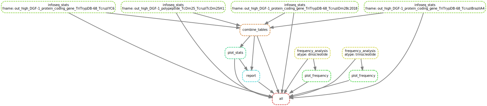

# hi-snakemake

pipeline en Snakemake para validar archivos FASTA, calcular GC%, calcular largo de secuencia, obtener composición nucleotídica, combinar las tablas y generar un reporte automático en Quarto creando una web.

## Entorno de ejecución

El pipeline utiliza Snakemake para la gestión de flujos de trabajo y Pixi para la gestión de entornos reproducibles. Asegúrate de tener ambos instalados antes de ejecutar el pipeline. Asimismo, recomendamos trabajar en visual studio code dado que facilita la edición y ejecución de scripts. Para poder ver la pagina web generada, es necesario tener la extension de `live server` instalada en VSCode.

## Pixi entorno reproducible

Pixi es un gestor de entornos simple y rápido, similar a Conda, que garantiza que Snakemake y todas las dependencias del pipeline funcionen igual en cualquier computadora.

### Instalar Pixi
Para instalar Pixi, ejecuta el siguiente comando en la terminal
```{bash, eval = FALSE}
curl -fsSL https://pixi.sh/install.sh | bash
```

y luego

```{bash, eval = FALSE}
echo 'export PATH="/ruta actual/.pixi/bin:$PATH"' >> ~/.bashrc # agrega pixi al PATH
source ~/.bashrc # recarga el .bashrc
```

Esto permite usar el comando `pixi` en cualquier lugar de la terminal. El método de instalación varía según el sistema operativo, para más detalles visita [pixi](https://pixi.sh/#/install)

## Instalar todas las dependencias

utilizaremos Snakemake para la orquestación del workflow, el mismo, requiere varias herramientas, incluyendo Python, SeqKit, Quarto, y R (`ggplot2`, `dplyr`, `seqinr`, `tidyverse`, etc).

La configuración está contenida en el archivo `environment.yaml`. Para configurar e instalar todas las herramientas automáticamente, ejecuta el siguientes comandos:
```{bash, eval = FALSE}
pixi init --import environment.yaml
```

y luego
```{bash, eval = FALSE}
pixi shell
``` 

Esto creará los entornos necesarios para ejecutar el pipeline.

Una vez dentro del entorno de Pixi y con todas las dependencias instaladas, puedes ejecutar el pipeline de Snakemake.
## Ejecutar el pipeline
Para ejecutar el pipeline, asegúrate de estar en el entorno de Pixi y luego ejecuta el siguiente comando en la terminal:
```{bash, eval = FALSE}
snakemake --cores 10
```
Esto ejecutará el pipeline utilizando 10 núcleos de procesamiento. Puedes ajustar el número de núcleos según la capacidad de tu máquina.



Para obtener un reporte detallado de la ejecución del pipeline, puedes agregar la opción `--dag` para generar un gráfico del flujo de trabajo:
```{bash, eval = FALSE}
snakemake --cores 10 --dag | dot -Tsvg > dag.svg
```

generando esta figura `dag.svg` que muestra las dependencias entre las reglas del pipeline.


## Resultados
Los resultados del análisis se guardarán en la carpeta `results/`, incluyendo tablas de estadísticas y gráficos generados.

## Visualizar reporte web
Para visualizar el reporte web generado, abre el archivo `results/report.html` en tu navegador web o utiliza la extensión de Live Server en VSCode para una mejor experiencia. Para hacer uso de Live Server, haz clic derecho en el archivo `report.html` y selecciona "Open with Live Server". 
